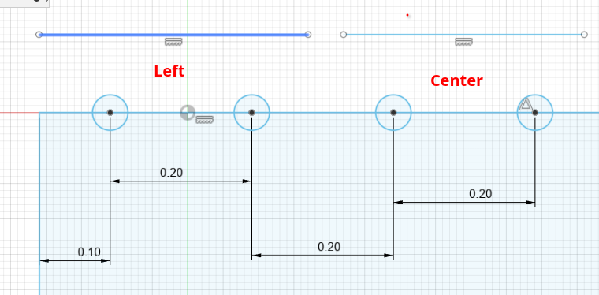
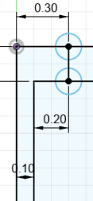

# Introduction

## Purpose

This is a specification for the technical aspects of how the language works, 
this will extend on the concepts covered in the `overview-srs.md` file. 
This document will go over the technical aspects of how the language should be implemented and the 
reqirements for interoperability.

## Intended Audience

The readers of this document should be those who plan on creating a program in order to interpret, 
compile, execute, or edit the program files defined later in this document.

## Intended Use

The files will be output from programs into a form that is sharable by the end user, 
as specified in the overview.

## Scope

This will be definitions of the storage medium and builtin functions for the system.

## Definitions and Acronyms

//todo

# Design

## File storage

The file will be stored in XML, templating out the actual contents of the file: 
```xml
<code name="" version="1.0">
    <headers>
        <custom name="blockname">
        <!-- code -->
        </custom>
    </headers>
    <main>
        <!-- code -->
    </main>
</code>
```

## layout

code blocks will contain a list of blocks and a list of wires contained. both with their absolute 
positions on a canvas, the blocks should reference the wires they are connected to and vis-versa in arguments.

example using pseudo-blocks:
THIS IS NOT THE FULL SPEC AND SHOULD NOT BE USED AS A REFERENCE FOR SUCH
```xml
<main>
    <wires>
        <wire wireid="0">
            <end x="0" y="0" block="0" port="out" />
            <segment x=".5" y=".5" />
            <end x="1" y="1" block="2" port="in" />
        </wire>
    </wires>
    <blocks>
        <globalinput blockid="0" name="a" out="0" x="-2" y="3" />
        <globalinput blocid="1" name="" x="-2"  y="0" />
        <blocka blockid="2" x="0" y="0" inp1="0" out2="2" />
    </blocks>
</main>
```

main also counts as a code block as it can have inputs and outputs.
a value of -999 (or no value) means an input is not connected.

### wire branching

Wires should be capable of branching in order to connect one output to multiple inputs 
(multi-input will be unsupported and should throw an error, except through some kind of "mux" block to run 
each synchronously, this will be described more later). In order to support that, wires can specify a branch 
block in them which will act as a normal segment block, except it will have contents that end with an end block.

```xml
<wire wireid="0">
    <end x="0" y="0" block="0" port="out1"/>
    <branch x=".5" y=".5">
        <end x="0" y="1" block="3" port="in1"/>
    </branch>
    <end x="1" y="1" block="2" port="in2"/>
</wire>
```

the `<end>` tags should specify the blockid and port within the block to target. ie `block="2" port="name"`


### grouping without creating a codeblock

there can be artificial grouping by creating a group block around a group of blocks in main, 
there are 2 types of groups, named groups and commented out groups

```xml
<commented>
    <blocka ...>
</commented>
<group name="test">
    <blocka ...>
</group>
```

### commenting

As specified in the previous section. commented groups will not run (of course)

## How does it run

In order to run, the code takes all the independent "webs" traverses them to the inputs and runs them through. The order in which each web is run to eachother is not defined and for all intents and purposes should be treated as asynchronous, in order to "combine" independent webs with timing requirements. For actual web running itself, the order of the sub-web for each input to a block is not defined, it will be only run once but if there are multiple independent sub-webs inputting into a block, the order they run is not defined and can be parallel.

There will be a block that combines two or more nets to specifically run after eachother.

```xml
<main>
    <sync>
        <group>
        </group>
        <group>
        </group>
    </sync>
</main>
```

# Block specification

## block type headers

blocks can be optionally be defined in a `<headers>` tag or file,
this is also the spec for how custom blocks are defined, except there is a bit more to them that will be
explained in a further section. 
this will allow for editors to not need to know all the block types without actually having access to 
the runtime environment. for these headers the blocks will be defined as such:

```xml
<headers version="1.0">
    <block name="">
        <io>
            <input side="top" justify="center" name="name" type="boolean" optional="true" />
            <output side="bottom" justify="center" name="name" type="int"/>
        </io>
        <image src="path/to/img.png" />
    </block>
</headers>
```

where the blockid tag is named by how the block should be called later.

### include

block type headers may include an `<include>` tag, this will have attributes of `src` and `intern` which only one of is allowed,
if src, it loads headers for the file at the src path, if intern, it loads the headers from within the runner.

ie. to include stdlib headers explicitly, tho this will be implicitly done by the runner as the first element:
```xml
<headers version="1.0">
    <include intern="stdlib" />
</headers>
```

### typing

#### primitives

primitive IO types are as follows:
* boolean
* number
* string
* object
* list
* any

#### generics

generic types can also be made to be used, blocks can have a `<generics>` tag, this will contain
the specification for each generic like so:
`<generic name="T" extends="number">` extends and super are both valid, they work similarly to java in how
they limit the generic, they therefore are both optional, and generic will accept "any" if none is selected.

### grouping

in order to allow editors to group the types of blocks, they are allowed to specify a group attribute, in the top tag
ie: `<block name="add" group="math">`, to specify multiple groups, they will be comma separated. this does mean that a comma
is not a valid character in a group name.

### io

the inputs and outputs tags are optional, and contain info about where the inputs and outputs are.
there are 12 sections for the inputs and outputs, each side with left, center and right alignment.
there is also an optional <skip> tag which will leave a blank space with the same width as an input.
each input/output name must be unique in order to allow the wires to specify which input it is actually connected to
without having to rely on the x/y positions to be completely to-standard and accurate.

### image

the image tag is optional, and contains the path to the image to be used for the block, otherwise the editor will 
do something else for rendering, most likely the name will be displayed.

### hollow

there is also an optional tag `<hollow name="" paddingTop="" paddingLeft...>` which corresponds to making this block hollow and having code
specified by `<innercode>` as described below. the padding's correspond to the ammount of distance between the outer and inner edge.

If there are multiple hollow blocks they will be stacked vertically.
the minimum inner size of a hollow section is 1x1 units

there is also an option to have the hollow sections on-top of eachother with a selection for switching between them.
in order to get them to show up like that, is to add a `group="name"` attribute to the hollow block.

with those, there is the option to have a dynamic number of hollow blocks stacked using the 
`<dynamichollow>` tag, but those arn't allowed to use the `name` attribute, or share a group with another hollow block. 

those are specified like so:
```xml
<dynamichollow group="name" paddingTop="0" paddingLeft="0" paddingRight="0" paddingBottom="0">
</dynamichollow>
```

the type can be number, string, or boolean.

inside the "hollow" or "dynamic hollow" tag, there is a `<innercode>` tag, inner io will be specified for interacting with the "parent block".

These blocks can also directly interact with their inner code using input/outputs defined within the hollow tag.
this will act similarly to normal io, styling etc, but will be used to connect the inner code to the outer block.
to specify the connection, the outer block wll have an id of `-1` in the innercode for the innercode's outputs (so direction = out, or hollow outputs)
and `-2` for the innercode's inputs (so direction = in, or hollow inputs).

### code

if this block is a custom block, then the code tag is required, it's contents will be the same as an overall file's context,
as in a set of wires, in that case the inner `globalinput` and `globaloutput` tags correspond *only* to 
the inputs and outputs of the block itself. 
## block referencing

blocks are then referenced in a way that is (incorrectly) shown above, the real way is like:
```xml
<block blockid="0" x="0" y="0" flipH="false" flipV="false" rotate="0" scaleX="1" scaleY="1">
    <io>
        <input name="a" wireid="" />
        <output name="b" wireid="0" />
    </io>
</block>
```

if a block is hollow, it will also contain a section inside of it called `<innercode name="">`
which will contain the code that is inside the block, this will be explained in a bit more detail below.

the rotate value will be an integer mod 4 that will be how many 90 degree clockwise rotations the block is rotated by.

the following subsections will cover the specifics of what the block definition looks like for each type of block,
as well as specific rendering guidelines.

### general

The basics of how blocks generally looks is defined above, this section will be the *general* rendering guidelines that will be
expanded on in the more specific sections below.

For rendering blocks, their minimum size is the maximum of (1 x 1) or the total width of their io,
they don't have to remain square and so this means that a side is scaled by its io and the io on the opposite side.

For the terminals on the block, they are evenly spaced, at .2 apart, with the left/right justified ones starting .1 into the block,
the centered ones will be centered, obviously, and the left/right/center will be separated from eachother by at least .2 of the block.
the user may resize a block to be larger, in which case the spacing between left/right/center is what will expand in distance.
See the diagram below:



This diagram shows the spacing of the left side of a block with 2 io on the top-left, and 3 on the center. 
The resulting block would have a width of 1.4 units.

on the sides, the left/right will mean top/bottom respectively.

### normal blocks

normal blocks generally refers to blocks that are not hollow, and have no inner code.
these have been practically fully explained already, so no need to go into detail.

#### primitive operations

Same with these, they are the most basic blocks, and are just a type of normal block.
these will generally have 2 inputs on the left and one output on the right.

### const blocks

const blocks have a `<value>` tag, in addition to those of the normal block.
at runtime, this is a user-inputtable value that automagically selects it's type based on where it's wired.
if wired to an enum, this will mean that the enum will be used to select the value from a dropdown,
wired to an integer will mean that the value will be an integer, etc.
When not wired anywhere, the user will not be able to change the value, but it will stay as the last type until
it doesn't make sense, ie, wired to a different type.

if the wire type is "any" then the value will be a string and allow any input.

### global input/output
globalinput/output will be referenced like other blocks, but will have
the `<value>` tag to specify the name of the variable to be used.
ie.
```xml
<globalinput blockid="0" x="0" y="0" flipH="false" flipV="false" rotate="0" scaleX="1" scaleY="1">
    <io>
        <output name="out" wireid="" />
    </io>
    <value>a</value>
</globalinput>
```


### "hollow" blocks

"hollow" blocks are blocks that contain at least one `<hollow>` block.
these blocks allow for having inner code that is executed inside of the block, and can be used to make
"anonymous function" aka "lambda" blocks, they can also be used for states in flow control or loops.
one condition of wires with these blocks is that they will connect through a "tunnel" that pipes the wire through the
outer block to the inner block. these tunnels will only allow for the inputs to be run once, and the output to be outputted
once the outer block declares it is "finished".
 
they also allow for a "passthrough" or pipe, which is a dynamic way to connect an outer wire into the inner block,
this will work by creating a "virtual" port where the outer wire is connected to, and the inner wire is then connected via
a visual "tunnel" to a virtual innerio port. the "names" of these ports for the wires to connect to will be `virtual$` followed
`forName$` or `forGroup$` then the group a $ then id attribute, ie `virtual$forName$name$0`. specifying a virtual port is shown in the `<virtual>` tag which looks as follows:

```xml
<block ...>
    <virtual forName="example">
        <port direction="in" id="0">
            <outer wireid="0" side="top" offset=".3"/>
            <inner wireid="0" side="top" offset=".2"/>
        </port>
    </virtual>
    <innercode name="example">
        <wires>
            <!-- code -->
        </wires>
        <blocks>
            <!-- code -->
        </blocks>
    </innercode>
</block>
```

there are 2 possible attributes for the `<virtual>` tag: `forName` and `forGroup`. these specify which innercode these
ports are for. if `forName` is specified, then the innercode will be searched for by name, and if `forGroup` is specified,
then the innercode will be searched for by group.

The offsets are relative to the left edge of the face they are on, so this would look something like:



Also, when this is `direction="in"` this passthrough also allows for a "loopback" so that the inner code can set a value
for if the block runs the inner code multiple times (like in loop blocks). this will cause the io to offset -.05 and .05 on the inside
with the right one being the loopback. additionally, it's port string value will have `$loopback` appended to it in order to distinguish it from
the normal passthrough.

For stacked blocks, the virtual ports can be shared between the blocks as they are on-top of eachother so that makes sense.
Also, for specifying dynamic hollow blocks, the inner code tags will use the name and then use `id="id"` where the id is specified
as stated in the block specification, but each must be unique.

#### flow control

flow control refers to a special type of hollow block that is used for flow control,
for example, loops, if statements, switch, etc.

if statements would have 2 hollow blocks, one for the if statement, and one for the else statement.
the loop block will have a hollow block inside of it, this block will output a boolean value, which will be used to determine
if the loop should continue or not.