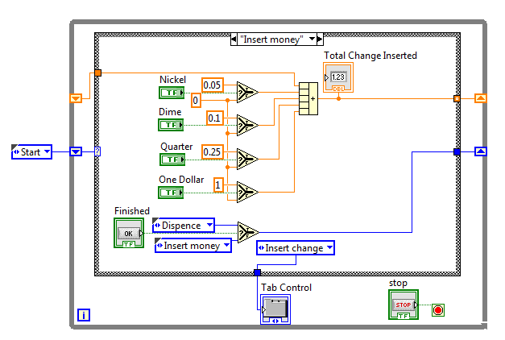

this is my first requirements document, it is not super serious since I intend to do all the parts of this process myself, I am not (yet) a software engineer, I've only taken the first course (SE 300) and not the second half of it (SE 310), that'll be next semester.

# Introduction

## Purpose

In order to create a beginner friendly macro software, it becomes nececairy to create a way to abstract the "difficult" process of coding. this is the overview specification for the requirements of what are needed out of the other specifications where it is stated *how* things will look/function.

## Intended Audience

The intended audience of this specification sheet is the developers who plan on implementing an interpreter or viewer for the language created herein.

## Intended Use

The intended user of the language is people who are new to coding, tho it should be powerful enough to do complicated tasks for people who "know what they are doing" in it.

## Scope

a diagram (node) based programming language that can interact with java and minecraft. This is a language similar in style to NI Labview, as depicted below

## Definitions and Acronyms

//todo

# Overall Description

## User Needs

The expected users of this are people who may not have any experience coding. I expect them to *try* to use this to achieve complicated behavoir once this is implemented into **jsmacros** and so this language needs to be powerful enough, but also easy enough to understand in order for new coders to not have too much of a learning curve.

Secondarily, more experienced coders may try to use this to implement complicated schemes just to see if they can, and so supporting more "powerful" use cases where efficiency is more important, must be supported.

## Assumptions and Dependencies

This initial specification will refer to **java**, **lwjgl**, **jsmacros** and **minecraft** as that's what the first interpreter, or compiler, and editor will be written and targeted to interact with. It may become useful in the future to exapand at least one of those (editor probably) onto another platform to allow the user to edit elsewhere, such as in the web browser.

# System Features and Requirements

## Functional Requirements

* have a common library to help the user with achieving simple tasks
  * this will be expanded in the actual language spec, I don't care about actual contents here
* capable of creating custom blocks
* typing and type casting

## External Interface Requirements

* capable of interacting with java classes
* capable of "proxying" java objects (as well as its own)
* custom blocks can (also) be external code

## System Features

* turing complete, like not minimally tho
* capable of asynchronous running
* capable of time-based operations
* capable of loops
* capable of having blocks which can input/output other blocks contained within them, so essentailly it's hollow, (this will also essentially be how loops work)

## Nonfunctional Requirements

* must run sufficiently fast to be comparable to other java guest languages
  * (so like 2s max for computing 2000 prime numbers using a similar implementation as in my benchmark scripts)